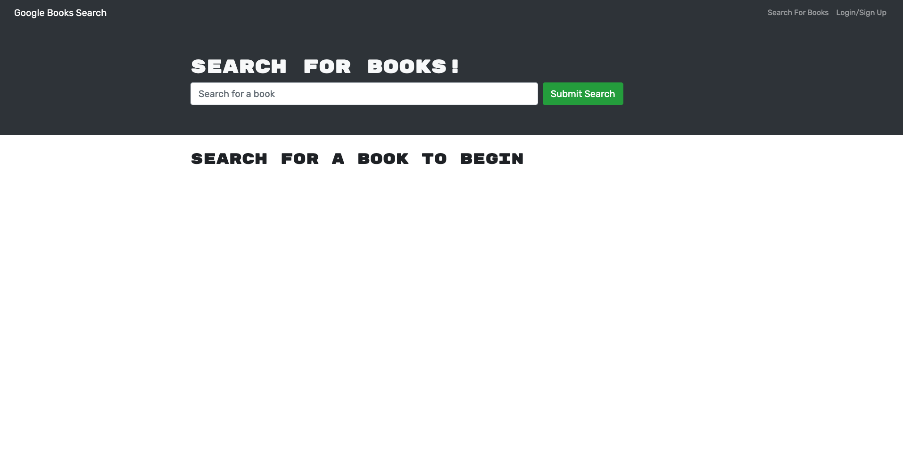
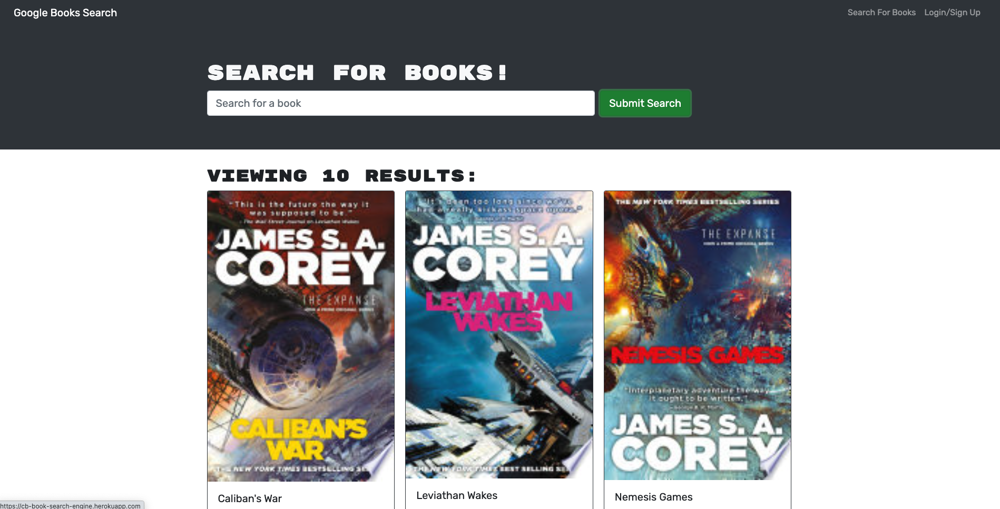
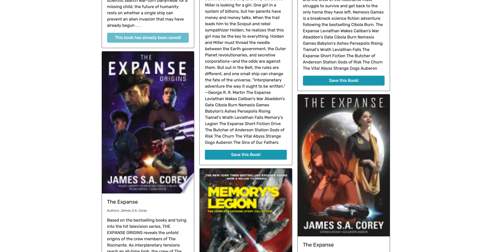
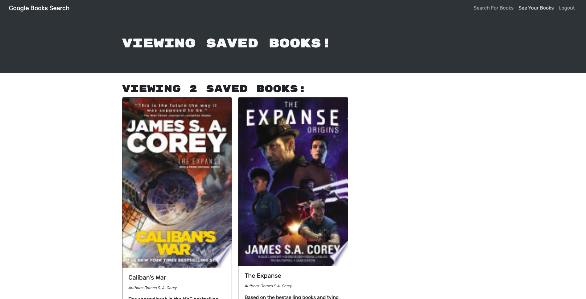

# MERN Google Book Search Engine

## **Description**

This full-stack MERN application utilizes the [Google Books API](https://developers.google.com/books) to search for books based off of users' inputs and outputs the following fields: book title, book author(s), and description.

Additionally, users that create profiles may save searched books and access that list at any time.

## **Site Links**

[Heroku deployed site](https://cb-book-search-engine.herokuapp.com/)

## **Site Screenshots**

